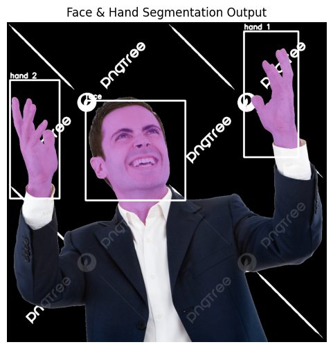

# Automated-Face-Hand-Segmentation-Using-SAM2-API

This project performs **automated detection and segmentation of human faces and hands** from static images using **MediaPipe** and the **Segment Anything Model 2 (SAM2)** via Replicate API. It consists of a full Python pipeline and an interactive **Streamlit UI** for easy uploading and visualization of results.

---

## 📁 Project Structure

```

├── detection\_segmentation.py     # Core detection & segmentation logic
├── app.py                         # Streamlit web app
├── Streamlit_UI.png               # Screenshot of the Streamlit app
├── requirements.txt               # Required dependencies
├── input\_image.jpg               # Sample input image
├── output\_image.jpg              # Sample output after segmentation

````


---


## 🚀 Setup & Installation

1. **Clone the Repository**
   ```bash
   git clone https://github.com/your-username/face-hand-segmentation.git
   cd face-hand-segmentation
    ````

2. **Install Dependencies**
   Create a virtual environment (recommended) and install dependencies:

   ```bash
   pip install -r requirements.txt
   ```

3. **Set Your Replicate API Key**
   Create a `.env` file or set your environment variable in terminal:

   ```bash
   export REPLICATE_API_TOKEN=your_token_here
   ```

   Or edit the Python files:

   ```python
   import os
   os.environ["REPLICATE_API_TOKEN"] = os.getenv("REPLICATE_API_TOKEN")
   ```

---

## ⚙️ How It Works

### 1. **Face & Hand Detection (MediaPipe)**

The uploaded image is passed through:

* `MediaPipe FaceDetection` → detects face bounding boxes.
* `MediaPipe Hands` → detects multiple hands and returns landmarks.

### 2. **Bounding Box Expansion**

Each bounding box is scaled to better fit the full target region (face/hand) before segmentation.

### 3. **Segmentation using SAM2 (Replicate API)**

Using the bounding boxes, each region is segmented using the **Segment Anything v2** model hosted on Replicate. The best mask is selected based on **IoU (Intersection-over-Union)**.

### 4. **Overlay Results**

Segmented masks are overlaid on the original image with bounding boxes and labels like `"face"` or `"hand-1"`.

### 5. **User Interface (Streamlit)**

A clean Streamlit UI allows:

* Uploading an image
* Viewing original and segmented images side-by-side
* Downloading the segmented result

---

## 🖼 Output Samples

| Original Image              | Segmented Output              |
| --------------------------- | ----------------------------- |
|  |  |

---

## 📦 Requirements

Dependencies are listed in `requirements.txt`:

```txt
streamlit==1.35.0
opencv-python==4.9.0.80
mediapipe==0.10.9
numpy==1.26.4
requests==2.31.0
Pillow==10.3.0
replicate==0.24.0
```

Install using:

```bash
pip install -r requirements.txt
```

---

## ⚠️ Limitations & Edge Cases

* **Replicate API Token**: Required and must be securely set via environment variable.
* **Rate Limits**: Replicate may return `429 Too Many Requests` if overused. A delay is added between requests.
* **Multiple Hands/Faces**: Detects multiple hands but segmentation is limited to bounding box accuracy.
* **Internet Required**: API calls require an active internet connection to access Replicate.

---

## 📤 Deployment

To run the Streamlit app locally:

```bash
streamlit run app.py
```

To test the core detection pipeline without UI, run:

```bash
python detection_segmentation.py
```

---

## 👩‍💻 Author

Koilada Pavani Jyothirmai
BTech in CSE (AI & ML)
VIT-AP University

---


